# mcfx — Multichannel Cross-Platform Audio Plug-in Suite

A suite of multichannel VST/VST3/AU plug-ins and standalone applications for macOS, Windows, and Linux.

- Channel count is configurable at compile time (VST2 plug-ins support up to 128 channels)
- VST3: one binary per plug-in, automatically adjusts to the track's channel count (up to 64 channels)
- Built on the [JUCE](https://www.juce.com) framework (GPLv3)
- Designed to complement the [ambiX Ambisonic plug-ins](http://www.matthiaskronlachner.com/?p=2015)
- Ready-to-use binaries available at [https://github.com/kronihias/mcfx/releases](https://github.com/kronihias/mcfx/releases)

---

## Table of Contents

- [License](#license)
- [Plug-ins](#plug-ins)
  - [mcfx_convolver](#mcfx_convolver)
  - [mcfx_anything](#mcfx_anything)
  - [mcfx_graph](#mcfx_graph)
  - [mcfx_mimoeq](#mcfx_mimoeq)
  - [mcfx_delay](#mcfx_delay)
  - [mcfx_filter](#mcfx_filter)
  - [mcfx_gain_delay](#mcfx_gain_delay)
  - [mcfx_meter](#mcfx_meter)
  - [mcfx_send / mcfx_receive](#mcfx_send--mcfx_receive)
- [Prerequisites for Building](#prerequisites-for-building)
- [How to Build](#how-to-build)
- [Build Parameters](#build-parameters)
- [Changelog](#changelog)

---

## License

mcfx is free software licensed under the **GNU General Public License version 3 (GPLv3)**.

---

## Plug-ins

### mcfx_convolver

Multichannel convolution matrix.

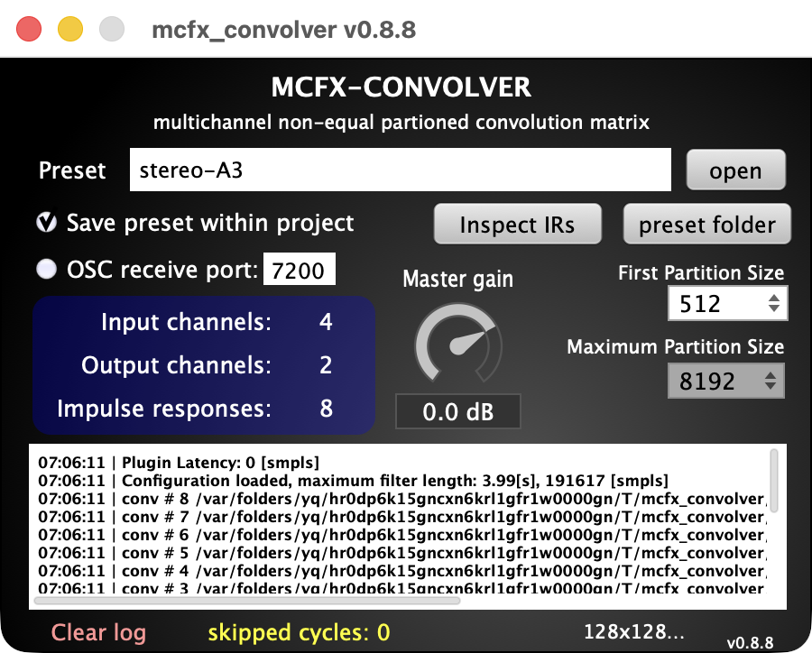


- Highly optimized non-uniformly partitioned fast convolution using SIMD for Intel and Apple Silicon
- Loads configuration files compatible with jconvolver `.conf` format
- Supports loading `.wav` files directly, optionally reading input channel metadata
- Drag and drop a `.conf` or `.wav` file onto the GUI to load it
- Option to embed the preset inside the DAW project (no external files needed)
- OSC remote control: `/reload`, `/load <preset.conf>` — configurable port
- See `CONVOLVER_CONFIG_HOWTO.txt` for configuration details and the `MATLAB/` folder for export scripts
- For an easier-to-configure convolver, see [mcfx_mimoeq](#mcfx_mimoeq)

**Preset search paths:**

| Platform | Path |
|----------|------|
| Windows | `C:\Users\<username>\AppData\Roaming\mcfx\convolver_presets\` |
| macOS | `~/Library/mcfx/convolver_presets/` |
| Linux | `~/mcfx/convolver_presets/` |

---

### mcfx_anything

Transforms (almost) any audio plug-in into a multichannel plug-in.

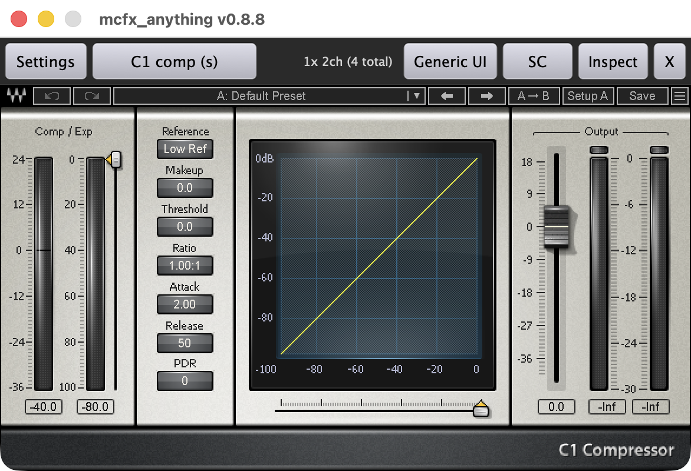


- Scans and hosts VST2, VST3, and AU plug-ins; scanning runs out-of-process for speed and crash-resistance
- Runs as many instances as needed to cover all channels of the mcfx multichannel bus — one instance per stereo (or N-channel) pair
- All instances stay in sync: parameter changes on the master instance are automatically mirrored to all slave instances
- Exposes up to 256 host-automatable forwarding parameters so DAW automation works transparently across all instances
- Supports sidechain routing: any input channel can be routed to the plug-in's sidechain bus
- Saves and restores the full plug-in state (including which plug-in is loaded) with the DAW project

---

### mcfx_graph

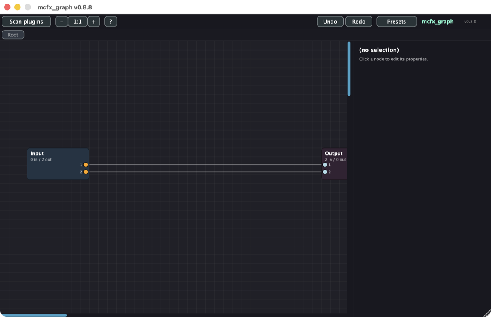

Flexible plug-in graph / patchbay. Load VST2 / VST3 / AU plug-ins as nodes, wire them together with bezier connections, and build entire signal flows inside one mcfx_graph instance. Multiple connections feeding the same input are summed automatically.

- **Native nodes:** Gain, Mute / Phase invert, Matrix Mixer (NxM), Delay, and recursive Subgraph nodes
- **Editor:** drag-to-connect pins, multi-select + group drag, snapshot undo / redo, Cmd-scroll zoom, drag-drop JSON load/save
- **Hosting:** VST2 / VST3 / AU with out-of-process scanning shared with mcfx_anything; per-node channel count probed against the plug-in's actual accepted layouts
- **DAW automation:** 256 forwarding parameters dynamically bindable to any inner-plug-in parameter
- **State:** human-readable JSON, embedded in the DAW project state and exportable as a `.json` file

See [mcfx_graph/README.md](mcfx_graph/README.md) for the full feature list and the keyboard / mouse shortcut reference.

---

### mcfx_mimoeq

Multichannel MIMO (Multiple Input Multiple Output) parametric equalizer.

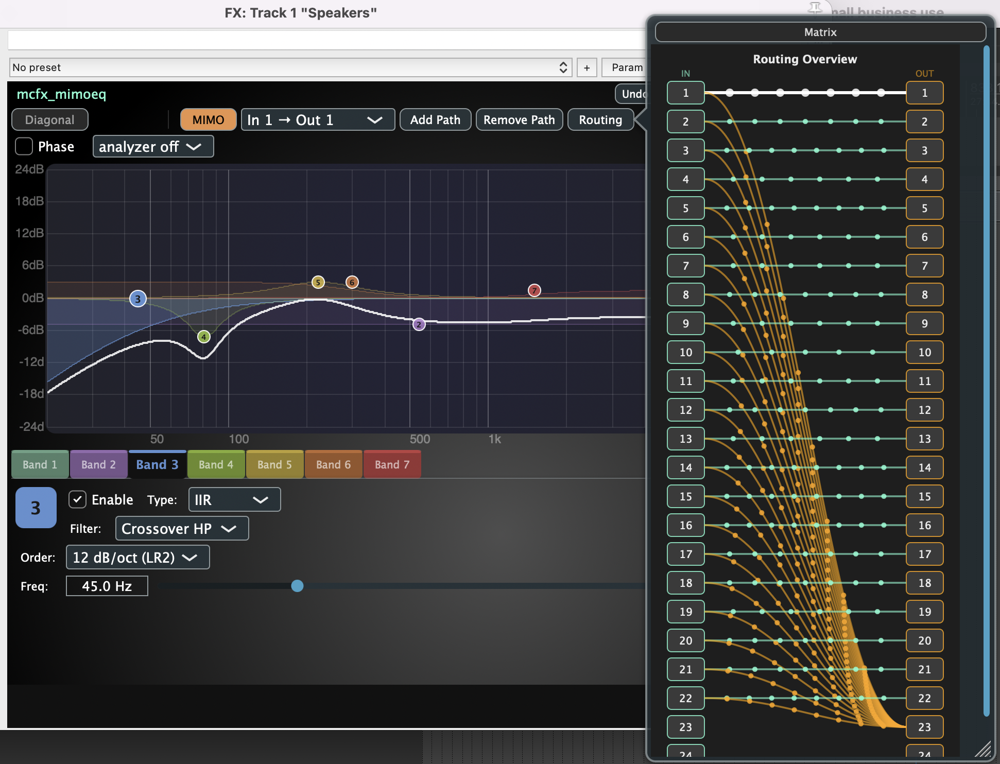


- Applies per-channel EQ on the diagonal (optionally restricted to a subset of channels) and per input-to-output path EQ chains for cross-channel processing
- Diagonal chain supports up to 24 automated IIR bands (HP, low shelf, peak, high shelf, LP) with host automation via VST3 parameters
- Dynamic EQ on peak/shelf bands: per-band threshold, range (cut or boost), attack, release, auto-threshold and **lookahead**. The detector tracks the band type (band-pass for peak, low/high-pass for shelves). A live gain dot, moving response curve and range bracket show the action on the graph. Detection is per-band link-selectable — *linked* drives one shared gain change across all channels (preserves Ambisonic/stereo imaging), *independent* lets each channel react on its own
- Lookahead is per band; the plugin latency-compensates all paths (diagonal + MIMO, including FIR latency) and reports the total to the host
- Individual input-to-output path chains for routing-aware corrections (e.g. speaker crosstalk compensation), supporting IIR, FIR (partitioned convolution), delay, and gain nodes
- Routing can be visualized as a matrix or wires view
- Built-in spectrum analyzer with per-channel or summed display, plus a rolling constant-Q spectrogram view (pre- or post-EQ, selectable time span)
- Loads and saves configuration as JSON files (allows importing automated speaker/room EQ configurations for large multichannel installations)
- Built-in undo/redo
- Can also be seen as a more flexible `mcfx_convolver`, but for dense filter matrices `mcfx_convolver` will be more efficient

---

### mcfx_delay

Delays all channels by the same amount.

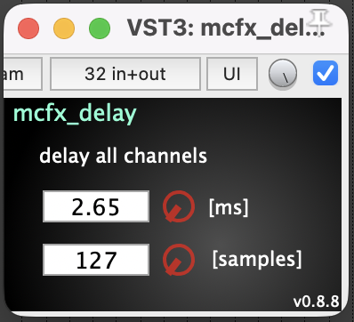


- Maximum delay time is set at compile time via `MAX_DELAYTIME_S` (default: 0.5 s)

---

### mcfx_filter

Applies identical filter settings to all channels, with a frequency analyzer showing the sum of all channels or a single selected channel.

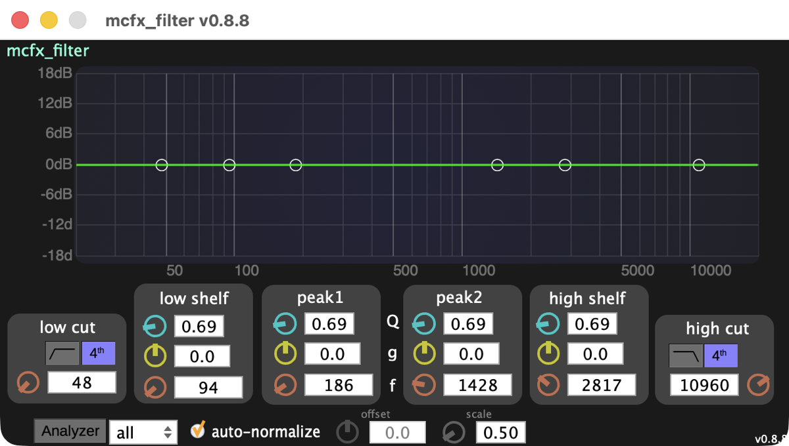


- Low/high pass: 2nd-order Butterworth or cascaded 4th-order (Linkwitz–Riley) for crossover use
- 2× parametric peak filters ±18 dB
- Low and high shelf filters ±18 dB
- All filter parameters can be adjusted during playback without audible glitches
- For a more flexible multichannel EQ, see [mcfx_mimoeq](#mcfx_mimoeq)

---

### mcfx_gain_delay

Per-channel gain and delay calibration tool, useful for multi-speaker setups.

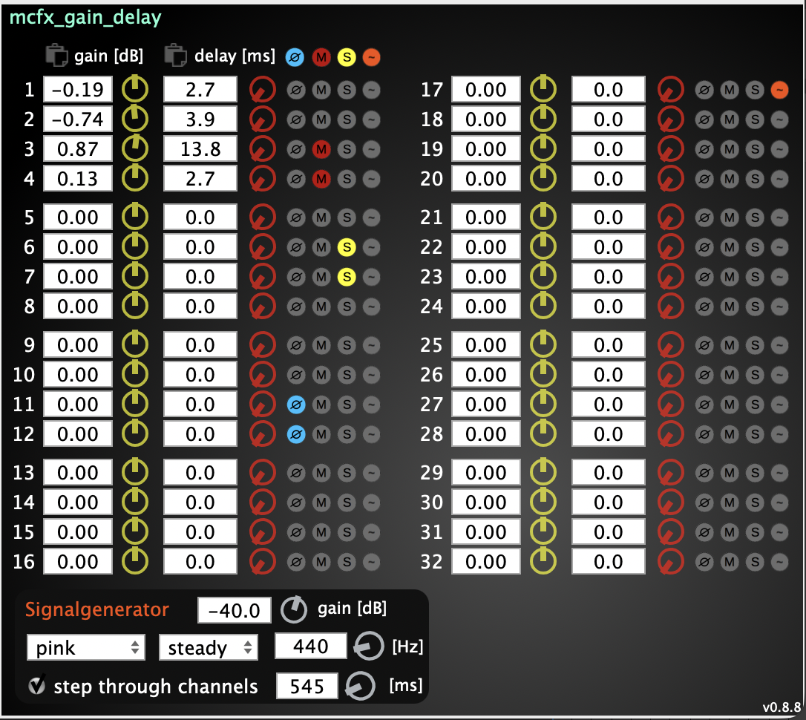


- Individual gain and delay per channel with phase, solo, and mute buttons
- Built-in signal generator (white/pink noise, sine, sawtooth, square, dirac, toneburst — steady or pulsed) for testing individual channels, or stepping automatically through all of them; sine frequency range down to 10 Hz
- Paste gain/delay values directly from the clipboard (semicolon, comma, newline, tab, or space separated)
- Maximum delay time set at compile time via `MAX_DELAYTIME_S`

---

### mcfx_meter

Multichannel level meter with RMS, peak, and peak hold. Four views: the classic bars, a ring that stays compact at any channel count, a dot grid small enough to leave open in a corner, and a 3D waterfall showing every channel's spectrum at once.

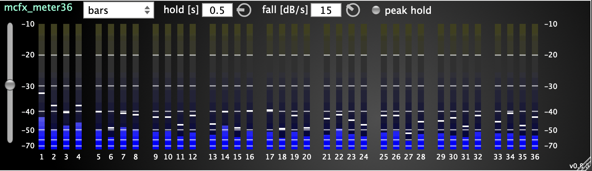

<p>
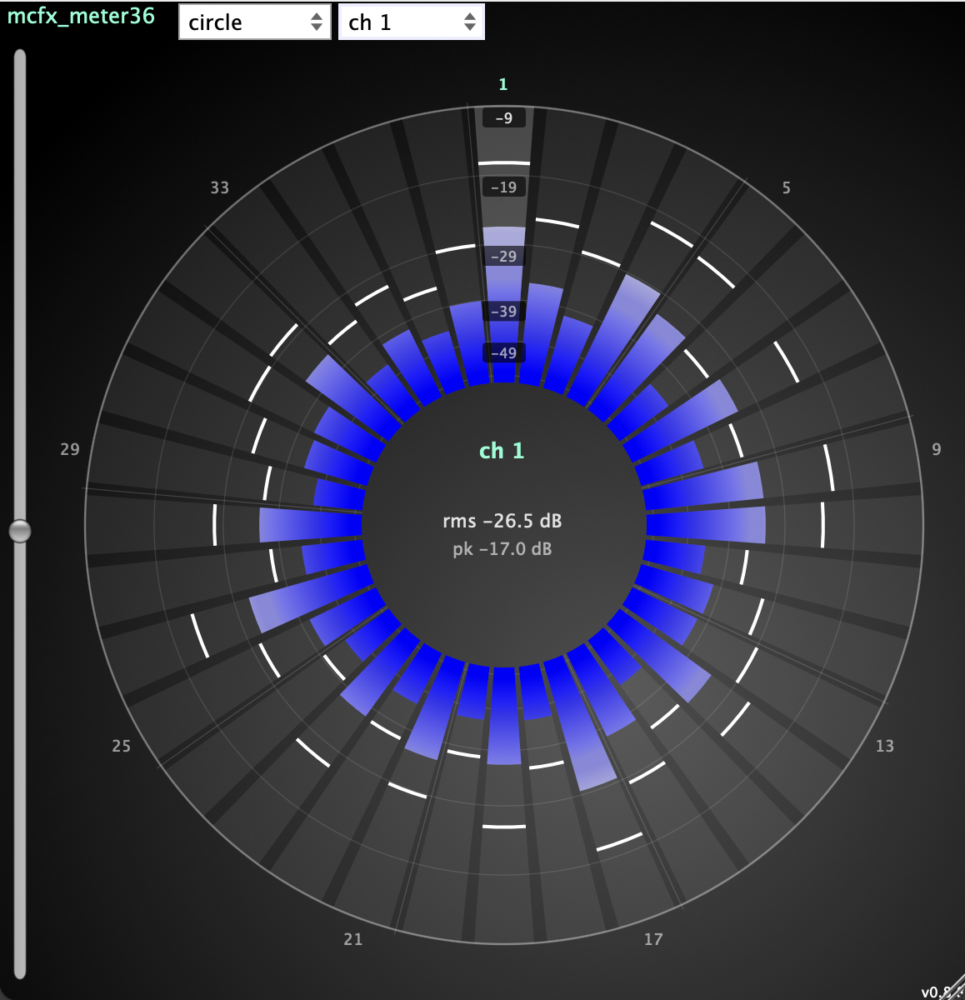
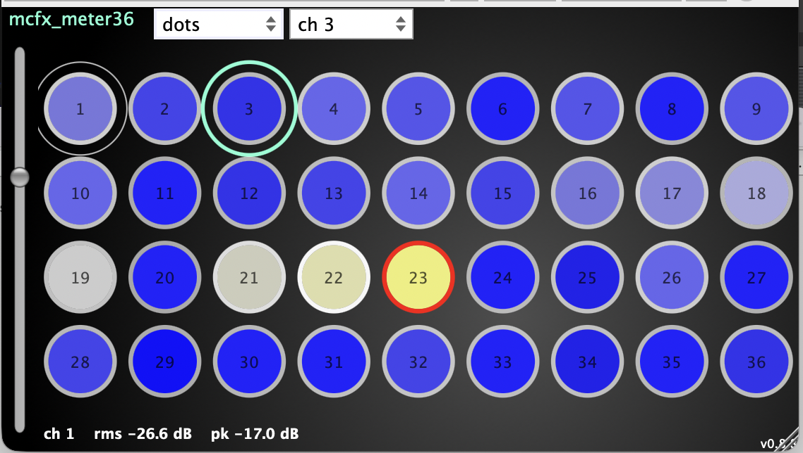
</p>

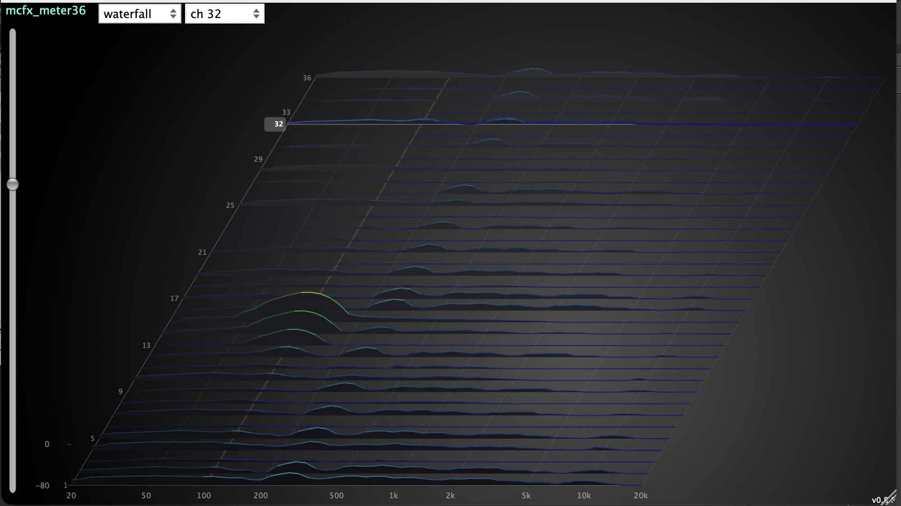


---

### mcfx_send / mcfx_receive

Simply send multichannel audio via network, with low latency, auto-discovery and optional password protection.

<p>
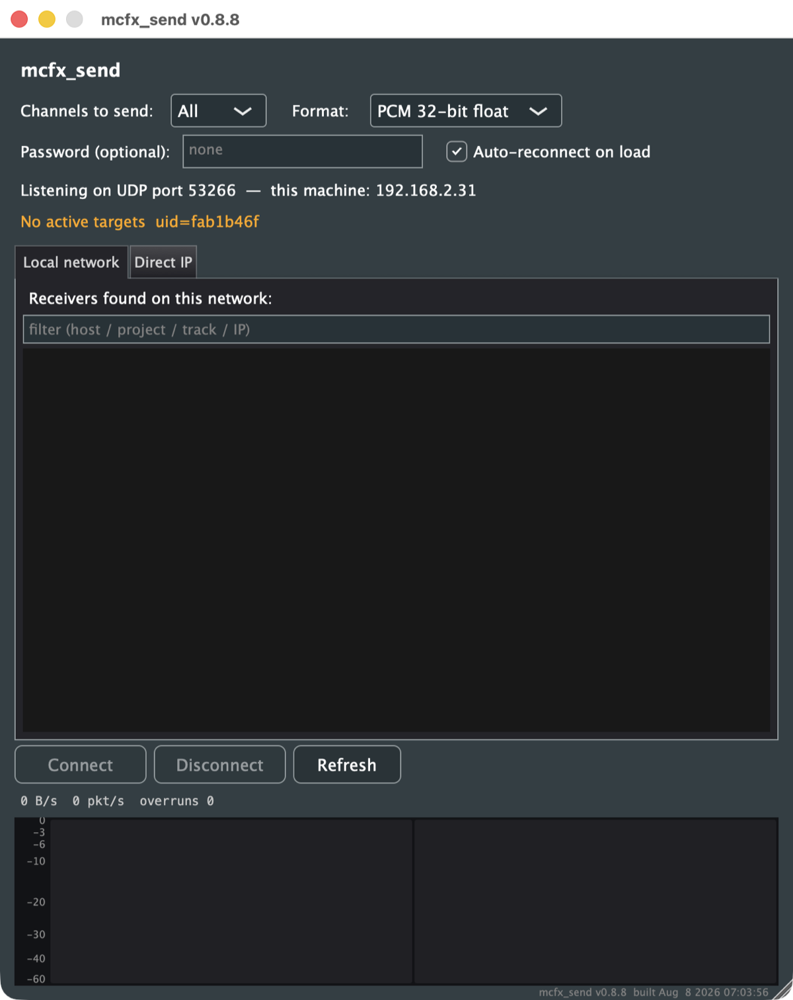
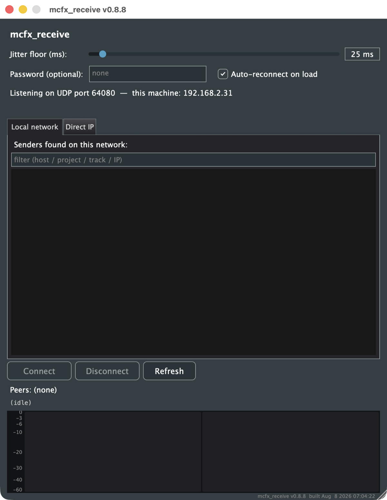
</p>

Note: Don't use for sensitive audio content, there is no encryption for lowest CPU load and latency.

Stream multichannel audio between machines on a LAN over UDP. `mcfx_send` packetises its input bus (up to 64 channels via VST3, 128 in AU/Standalone) as PCM 16-bit, 24-bit, or 32-bit float and unicasts it to one or more `mcfx_receive` instances; `mcfx_receive` decodes incoming streams and mixes them into its output bus through an adaptive jitter buffer and per-peer variable-ratio resampler that keeps it phase-locked to each sender even when the hardware audio clocks drift. Peers find each other automatically via Bonjour (or by typing IP and port directly), connections are symmetric and gated by an INVITE handshake with an optional shared password, and packets are marked DSCP-EF / WMM Voice for high-priority delivery on Wi-Fi and managed networks. See [mcfx_send/README.md](mcfx_send/README.md) and [mcfx_receive/README.md](mcfx_receive/README.md) for protocol and tuning details.

---

## Prerequisites for Building

CMake and a working build environment are required.

**Linux** — install dependencies (Debian/Ubuntu):

```bash
sudo apt install libasound2-dev libjack-jackd2-dev \
    ladspa-sdk \
    libcurl4-openssl-dev \
    libfreetype-dev libfontconfig1-dev \
    libx11-dev libxcomposite-dev libxcursor-dev libxext-dev libxinerama-dev libxrandr-dev libxrender-dev \
    libwebkit2gtk-4.1-dev \
    libglu1-mesa-dev mesa-common-dev \
    libfftw3-dev
```

> On older Ubuntu/Debian where `libwebkit2gtk-4.1-dev` is not available, substitute `libwebkit2gtk-4.0-dev` — JUCE 8 loads whichever is present at runtime. Likewise, fall back to `libfreetype6-dev` if `libfreetype-dev` is unavailable. If you intend to enable `WITH_ZITA_CONVOLVER` (off by default), also install `libzita-convolver-dev`.

**Windows x64** — FFTW3 is fetched and built by **vcpkg** (declared in [`vcpkg.json`](vcpkg.json) with SSE2/AVX/AVX2/threads features, statically linked into each plug-in — no DLL to ship). Both `scripts/build_all_win64.bat` and `tests/run_tests.py` auto-bootstrap vcpkg into `%USERPROFILE%\vcpkg` if neither `VCPKG_ROOT` nor (GH Actions') `VCPKG_INSTALLATION_ROOT` is set, so no manual setup is required.

To bootstrap vcpkg manually (e.g. to share one checkout across projects):

```
git clone https://github.com/microsoft/vcpkg "%USERPROFILE%\vcpkg"
"%USERPROFILE%\vcpkg\bootstrap-vcpkg.bat"
setx VCPKG_ROOT "%USERPROFILE%\vcpkg"
```

If you invoke CMake directly, point it at the toolchain and overlay triplet:

```
cmake -B build ^
    -DCMAKE_TOOLCHAIN_FILE="%VCPKG_ROOT%\scripts\buildsystems\vcpkg.cmake" ^
    -DVCPKG_OVERLAY_TRIPLETS=vcpkg-triplets ^
    -DVCPKG_TARGET_TRIPLET=x64-windows-static-md-release ...
```

Clone the repository including submodules:

```bash
git clone --recurse-submodules https://github.com/kronihias/mcfx/
```

---

## How to Build

Use **cmake-gui** or **cmake/ccmake** from the terminal.

1. Create a build folder inside the `mcfx` directory:
    ```bash
    mkdir BUILD
    ```

2. Configure with CMake (terminal):
    ```bash
    cd BUILD
    ccmake ..
    ```
    Press `C` to configure. When using the GUI, select your target build system (e.g. Visual Studio or MinGW on Windows).

3. Set the [Build Parameters](#build-parameters), configure again, then generate.

4. Build with your chosen build system. Example for Linux:
    ```bash
    make -j$(nproc) config=Release
    ```

5. After a successful build, find the binaries in `BUILD/vst/`, `BUILD/vst3/`, `BUILD/au/`, `BUILD/standalone/`, or `BUILD/lv2/` (depending on which formats you enabled) and copy them to your system plug-in folder:

    | Format | macOS | Windows | Linux |
    |--------|-------|---------|-------|
    | VST2 | `/Library/Audio/Plug-Ins/VST` | `C:\Program Files\Common Files\VST2` | `~/.vst/` or `/usr/local/lib/lxvst` |
    | VST3 | `/Library/Audio/Plug-Ins/VST3` | `C:\Program Files\Common Files\VST3` | `/usr/lib/vst3/` |
    | LV2 | `~/Library/Audio/Plug-Ins/LV2` | `%APPDATA%\LV2` | `~/.lv2/` or `/usr/lib/lv2/` |

    Each LV2 plug-in is a self-contained `<name>.lv2/` folder (the shared library plus its `.ttl` manifests) — copy the whole folder. On Linux, LV2 is the most portable native format and works in Ardour, Reaper, Carla, Qtractor, and other hosts.

---

## Build Parameters

| Parameter | Description | Default |
|-----------|-------------|---------|
| `NUM_CHANNELS` | Channel count for the per-channel VST2/LV2 build | `36` |
| `MCFX_MAX_CHANNELS` | Max channel count for the single-binary multichannel VST3/AU/Standalone build | `128` |
| `MAX_DELAYTIME_S` | Maximum delay time for `mcfx_delay` (seconds) | `0.5` |
| `BUILD_VST` | Build VST2 plugins (requires `VST2SDKPATH`) | **`ON`** |
| `BUILD_VST3` | Build VST3 plugins | `OFF` |
| `BUILD_AU` | Build AU plugins (macOS only) | `OFF` |
| `BUILD_STANDALONE` | Build standalone applications | `OFF` |
| `BUILD_LV2` | Build LV2 plugins (per-channel, like VST2 — needs `MCFX_BUILD_VST2_PER_CHANNEL=ON`) | `OFF` |
| `MCFX_BUILD_VST2_PER_CHANNEL` | Build per-channel VST2/LV2 variants (legacy) | `ON` |
| `MCFX_BUILD_MC` | Build single multichannel VST3/AU/Standalone | `ON` |
| `VST2SDKPATH` | Path to the VST2 SDK | `~/SDKs/vstsdk2.4` |
| `WITH_ZITA_CONVOLVER` | Use zita-convolver for better Linux performance (Linux only) | `OFF` |

**FFTW paths** (set manually if not found automatically):

- **`FFTW3F_LIBRARY`** — path to the FFTW3F library file (note the trailing **f**):
  - Linux: `/usr/lib/x86_64-linux-gnu/libfftw3f-3.so`
  - Windows/MSVC: `C:/Program Files/fftw-3.3.6-pl2-dll64/libfftw3f-3.lib`
  - Windows/MinGW: `C:/Program Files/fftw-3.3.6-pl2-dll64/libfftw3f-3.dll`
- **`FFTW3_INCLUDE_DIR`** — path to the FFTW3 include directory, e.g. `/usr/include`
- **`FFTW3F_THREADS_LIBRARY`** *(Linux only)* — e.g. `/usr/lib/x86_64-linux-gnu/libfftw3f_threads.so`

---

## Changelog
### 0.8.10 (2026-08-15)

- `mcfx_graph`: the **gain, delay and mute/phase nodes are automatable** — each publishes per-channel parameters that can be mapped to the plug-in's forwarding slots from the properties panel, the same way a hosted plug-in's parameters already could. Their panels follow values changed from the DAW, and a freshly mapped parameter reports its real value to the host straight away. (The matrix mixer stays out: an NxM matrix would publish far more parameters than the 256 slots available.)
- `mcfx_mimoeq`: fix host automation being dropped when it arrives while the processing state is being rebuilt (right after a preset load or channel-count change) — the pending-sync flag was cleared by the rebuild, so the parameter change updated the model and the GUI but never reached the audio path.
- `mcfx_anything`: fix an intermittent crash when changing the **sidechain source** on packed-sidechain plug-ins — the layout switch reloaded the hosted plug-in (GUI teardown included) synchronously inside the routing menu's callback; it now goes through the deferred loader. The sidechain source is also a host-automatable **"Sidechain Source" parameter** now (0 = off, k = channel k), appended after the forwarding pool so existing parameter indices are unchanged.
- `mcfx_graph`: hosts are now told when a forwarding slot is bound or unbound (`parameterInfoChanged`), so the exposed parameter's real name shows up in the host's parameter list instead of a stale generic entry. Also names the factory program — the VST3 validator fails an unnamed program, and hosts that gate on validation (e.g. Isadora) rejected the plug-in.
- `mcfx_delay`/`mcfx_gain_delay`: fix a crash when the host re-prepares one instance at a lower sample rate after processing — the delay ring's write position survived `prepareToPlay` while the buffer size shrank beneath it, and the wrap arithmetic ran a copy off the end of the buffer. This is exactly the sequence Steinberg's plug-in validator runs, so hosts that gate plug-ins on validation (e.g. Isadora) rejected both.

- `mcfx_filter`: 1/24-octave smoothing for the analyzer curves. One FFT bin per pixel left the top octaves ragged no matter the temporal smoothing — each pixel now reads the RMS over at least 1/24 octave, which flattens noise while keeping resonances and comb notches visible.

### 0.8.9 (2026-08-12)

- `mcfx_meter`: three new views alongside the classic bars — a **circle** that stays compact at any channel count, a **dots** grid small enough for a corner of the screen, and a 3D **waterfall** showing every channel's spectrum at once; channel selection is shared across views
- performance: the analysers' FFTs go straight to Accelerate (macOS) / FFTW (Win/Linux); `mcfx_mimoeq` no longer runs filter design or the spectrum FFT on the audio thread; much cheaper meter painting, and none at all when idle
- `mcfx_send`/`mcfx_receive`: smaller default window and a much lower minimum size. The peer list is what gives way when the window shrinks — the meter keeps its full height — and it now defaults to a handful of visible rows instead of a mostly-empty page, since a network rarely has more than a few peers.
- macOS standalones: request microphone permission properly (`NSMicrophoneUsageDescription`). Without the key macOS silently denied audio input — the device opened but delivered only zeros, so meters and analyzers showed nothing from live input.

- `mcfx_mimoeq`: **tilt** is also available in the linear-phase FIR designer — the same straight-line-in-dB shape as the IIR band, but realised exactly (the FIR is designed from the target line itself rather than approximated by a filter cascade) and with linear phase. It has the same min/max frequency limits as the IIR band, and being designed straight from the target line it follows them exactly instead of rounding the corners. The bottom octaves need a long filter to resolve, so check the realised-magnitude preview when using short lengths.
- `mcfx_mimoeq`: the linear-phase FIR designer's low/high pass now has a continuous **slope** control in dB per octave (3–48) in place of Q. Because the FIR is designed from a target magnitude rather than from a biquad, the roll-off doesn't have to land on a whole filter order — 7.5 dB/oct is as designable as 12. The corner stays at -3 dB (Butterworth), and 12 dB/oct reproduces the previous 2nd-order default.
- `mcfx_mimoeq`: new **tilt** filter type — a straight line on the dB / log-frequency graph. One control sets the slope in dB per octave (up to ±6); the band frequency sets where the line crosses 0 dB. Tilts the whole spectrum around that pivot without touching the level there — a single-knob tonal balance across many channels (-3 dB/oct is a "pink" tilt). Realised as a cascade of first-order sections fitted to the target line, holding it straight to better than 0.1 dB from 20 Hz to 20 kHz at any sample rate. **Min and max frequency** (default 40 Hz and 20 kHz) set where the line levels off, so a steep slope can't run away into huge boost at the extremes — the corners round off smoothly rather than breaking sharply.
- `mcfx_mimoeq`: rolling **spectrogram** view in the analyzer — switch the graph between the spectrum curve and a time-vs-frequency waterfall (colour = level) with the EQ response drawn on top; selectable pre-EQ or post-EQ source. Selected from the display row; the view and source persist with the plugin state.
- `mcfx_mimoeq`: the spectrum curve reads the **peak across each pixel's own frequency span** rather than one sample of it. High on the log axis a pixel covers a dozen analysis bins, so a narrow peak could fall between the sampled points and all but vanish — a steady 10 kHz tone read anywhere from -8 to -118 dB depending purely on where it sat relative to a pixel. Its analysis window also doubles to 8192 points, roughly doubling the detail in the bottom octaves at the cost of a slightly slower-settling curve.
- `mcfx_mimoeq`: the spectrogram is now fed by a **constant-Q transform** instead of the plain FFT. A linear-bin FFT is the wrong shape for a log-frequency plot — at 48 kHz a 4096-point one puts under two bins in the 20-40 Hz octave while spending 850 on 10-20 kHz — so the bass was a smear and the treble oversampled. The CQT places 24 bins per octave, lengthening its window towards the bass and shortening it towards the treble, which is both finer in pitch where it matters and faster on transients. Constant-Q holds down to 50 Hz at 48 kHz, tapering gradually below that.
- `mcfx_mimoeq`: spectrogram **scroll speed** — a selector next to the pre/post source sets how much time the vertical axis covers (2 to 60 seconds). Short spans show fewer of the stored rows so the picture scrolls faster; long spans write rows less often so the same rows reach further back, keeping the memory fixed either way.
- `mcfx_mimoeq`: the display settings have their own row under the mode/path row, separating what the graph *shows* from what is being *edited*. It carries the phase toggle and every analyzer setting — view (off / spectrum / spectrogram), pre/post source, channel, auto-normalize and offset. "off" being the first view means the analyzer needs no separate toggle, and nothing is hidden in a popup any more; controls that don't apply right now grey out instead. The window is one row taller as a result.
- `mcfx_mimoeq`: dynamic EQ on peak/shelf bands — per-band threshold, range (cut/boost), attack, release, auto-threshold, and a per-band detection link (linked = one shared gain change across channels, independent = per-channel). Type-aware detector (band-pass for peak, low/high-pass for shelves). Live gain dot, moving response curve and range bracket on the graph. Available on diagonal and MIMO path bands.
- `mcfx_mimoeq`: per-band **lookahead** for the dynamic EQ — the detector reads ahead of the audio so the gain is in place before a transient. All paths (diagonal + MIMO, including FIR latency) are latency-compensated and the total is reported to the host.

### 0.8.8 (2026-06-06)

- LV2: build all plug-ins as LV2 (`BUILD_LV2=ON`), verified on Linux
- `mcfx_anything`/`mcfx_graph`: embed the out-of-process plug-in scanner in the LV2 bundle so plug-in hosting works when built as LV2 (previously only VST3/AU/Standalone bundles got the scanner)
- docs: document LV2 install paths and that the LV2 build is per-channel (rides on `MCFX_BUILD_VST2_PER_CHANNEL`)

### 0.8.7 (2026-06-06)

**Main focus: improved Linux support.**

- Linux: native JACK standalone applications for all plug-ins — no longer requires a patched JUCE
- Linux: standalone Audio/MIDI settings can select multichannel devices and per-plug-in input/output channel counts
- `mcfx_anything`/`mcfx_graph`: LV2 and LADSPA plug-in hosting on Linux, user-editable plug-in scan folders, Linux VST3 scanner-helper packaging fix
- `mcfx_send`/`mcfx_receive`: JACK standalone channel fixes — `mcfx_send` captures all selected input channels, `mcfx_receive` exposes outputs only
- `mcfx_graph`: fix use-after-free when deleting a node, generic GUI fallback for plug-ins without an editor
- channel selectors accept typed values: `mcfx_send` channels-to-send, `mcfx_filter`/`mcfx_mimoeq` analyzer channel; `mcfx_convolver`/`mcfx_mimoeq` standalone links input/output channel count

### 0.8.6 (2026-05-27)

- `mcfx_anything`, `mcfx_graph`: plug-in scan UI fixes/improvements, avoid skipping some plugins on Mac

### 0.8.5 (2026-05-24)

- testsuite for Mac, Win, Linux
- Win: statically link to custom built fftw via vcpkg
- `mcfx_send`/`mcfx_receiver` network discovery improvements
- update to JUCE 8.0.13

### 0.8.4 (2026-05-17)

- `mcfx_mimoeq`: add advanced iir filters, add linearphase fir designer, add phase display
- `mcfx_mimoeq`, `mcfx_graph`: add preset factory, some gui improvements
- `mcfx_graph`: allow to rename nodes


### 0.8.3 (2026-05-07)

- mcfx_graph/anything: make sure plugin scanner is included in win build as well


### 0.8.2 (2026-05-07)

- mcfx_graph/anything: make sure plugin scanner is included in build, avoid having plugin scanner ghost processes, include input/output nodes in marque selection

- mcfx_send/receive: auto-reconnect when reloading session, report IP address in GUI, avoid duplicate entries in connection list

### 0.8.1 (2026-05-04)

- mcfx_graph: build for windows, add copy/paste, fix vst3 channel count selection, make json files portable by not saving the absolute plugin path, save/recall input/output node positions, add scrolling to matrix parameter view
- mcfx_convolver: add individual ir .wav export to inspector

### 0.8.0 (2026-05-03)

- improved `mcfx_anything` robustness, disable editing of children's GUI - all parameters should stay in sync with the main plugin instance. use `mcfx_graph` if you want to have different parameters for each plugin instance.
- **New:** (beta version) `mcfx_graph` — flexible plug-in graph / patchbay. Host any number of VST2/VST3/AU plug-ins as nodes, connect them with wires, summing on shared inputs, with native gain / mute-phase / matrix mixer / delay nodes, nested subgraphs, multi-select + chain-connect, undo/redo, drag-drop JSON load/save, 256 DAW-automatable forwarding parameters, and a searchable plug-in selector with format filters
- **New:** (beta version) `mcfx_send` and `mcfx_receive` - send/receive multichannel audio via local network, with low latency and auto-discovery - for really fast setup eg. in computer music ensembles, spatial audio concerts, ...
- Refactor: out-of-process plug-in scanner code (`OutOfProcessPluginScanner.h`, `findScannerExecutable`, scanner `Main.cpp`) moved to `common/PluginHost/` and is shared between `mcfx_anything` and `mcfx_graph`

### 0.7.0 (2026-04-19)

> *Dedicated to Angelo Farina, whose pioneering work on multichannel audio, Ambisonics, and room acoustics measurement was a great inspiration for these plug-ins.*

- `mcfx_convolver`: performance optimizations (avoid allocation in audio callback, convolver engine improvements) - thanks to Angelo Farina, Luca Battisti and Domenico Stefani
- **New:** `mcfx_anything` — transforms (almost) any plug-in into a multichannel plug-in via multi-instance hosting, parameter sync, DAW automation forwarding, and out-of-process scanning
- **New:** `mcfx_mimoeq` — multichannel MIMO parametric filter (IIR, FIR, delay, gain) with diagonal and per-path chains, up to 24 automated bands, spectrum analyzer, and JSON preset support
- `mcfx_delay`: fix delay time rounding issue
- VST3 plug-ins now automatically adjust to the track's channel count — one binary per plug-in, up to 64 channels (AU and VST2 support up to 128); VST3 is recommended going forward
- update to JUCE 8

### 0.6.4 (2024-03-20)

`mcfx_convolver`: add master gain parameter and rotary control, mechanism to save channel count in WAV IR files, fix debug window. Add build and installer creation scripts.

### 0.6.3 (2023-12-21)

`mcfx_filter`: fix parameter smoothing to avoid instabilities and glitches while changing filter parameters; performance optimizations.

### 0.6.2 (2023-12-11)

Add 128-channel version of all plug-ins; adjust `mcfx_meter` and `mcfx_gain_delay` GUI to display 128 channels properly.

### 0.6.1 (2023-12-08)

`mcfx_convolver`: support loading `.wav` files directly (a `.conf` file is written to disk and loaded in the background); support drag/drop of `.wav` or `.conf` files onto the GUI.

### 0.6.0 (2023-04-16)

New builds optimized for Apple Silicon and 64-bit Intel Mac; Windows 64-bit. Update to JUCE 7; removed soxr dependency. `mcfx_gain_delay`: sine generator now starts at 10 Hz.

### 0.5.11 (2020-05-20)

`mcfx_convolver`: fix +6 dB gain on the macOS version (Windows was correct). **Note:** macOS projects using this plug-in will output 6 dB less than with older versions.

### 0.5.10 (2020-05-19)

`mcfx_filter`: High-Shelf Q was not stored in the plug-in state — fixed.

### 0.5.9 (2020-02-05)

`mcfx_convolver`: fix dropouts/artifacts for hosts sending incomplete block sizes (e.g. Adobe, Steinberg); fix reloading stored presets; add filter length and latency debug messages; fix GUI crash in Adobe hosts.

### 0.5.8 (2020-01-31)

`mcfx_convolver`: option to store preset inside the DAW project; allow exporting the stored preset as a `.zip` file.

### 0.5.7 (2019-04-28)

`mcfx_convolver`: OSC receive support (`/reload`, `/load <preset.conf>`); configurable OSC port in GUI.

### 0.5.6 (2019-03-20)

`mcfx_convolver`: maintain FIR filter gain when resampled; add plug-in parameter to trigger preset reload.

### 0.5.5 (2018-03-16)

`mcfx_filter`, `mcfx_gain_delay`, `mcfx_delay`: improved slider behavior for finer control. `mcfx_gain_delay`: Ctrl+click for exclusive solo/phase/mute; add toneburst to signal generator; fix saving channel state of signal generator.

### 0.5.4 (2017-05-20)

`mcfx_convolver`, `mcfx_filter`: fix thread-safety to avoid startup crash when other plug-ins use FFTW.

### 0.5.3 (2017-05-02)

`mcfx_delay`, `mcfx_gain_delay`: fix glitch in delay line.

### 0.5.2 (2017-03-20)

Various bugfixes. `mcfx_convolver`: performance optimizations; adjustable maximum partition size.

### 0.5.1 (2016-04-25)

`mcfx_convolver`: fix bug loading packed (dense) matrix. `mcfx_gain_delay`: GUI fix.

### 0.5.0 (2016-04-08)

Add signal generator to `mcfx_gain_delay`. `mcfx_convolver`: support packed WAV file for dense FIR matrix (see `CONVOLVER_CONFIG_HOWTO.txt`). `mcfx_filter`: smooth IIR filter to avoid clicks on parameter changes.

### 0.4.2 (2016-02-19)

Fix convolver bug.

### 0.4.1 (2016-02-17)

Fix convolver bug causing mixed-up partitions.

### 0.4.0 (2015-11-04)

GUI for `mcfx_delay` and `mcfx_filter` (with FFT analyzer). Add phase, solo, and mute buttons to `mcfx_gain_delay`.

### 0.3.3 (2015-07-19)

Performance improvements for `mcfx_convolver`.

### 0.3.2 (2014-12-28)

AudioMulch compatibility. GUI for `mcfx_gain_delay` with paste-from-clipboard. `mcfx_meter`: add scale offset.

### 0.3.1 (2014-06-16)

Fix VST ID for Bidule compatibility.

### 0.3 (2014-03-15)

Add `mcfx_convolver`.

### 0.2 (2014-02-25)

Remove license-incompatible code; JUCE update.

### 0.1 (2014-01-10)

First release.

---

&copy; 2013–2026 Matthias Kronlachner — m.kronlachner@gmail.com
